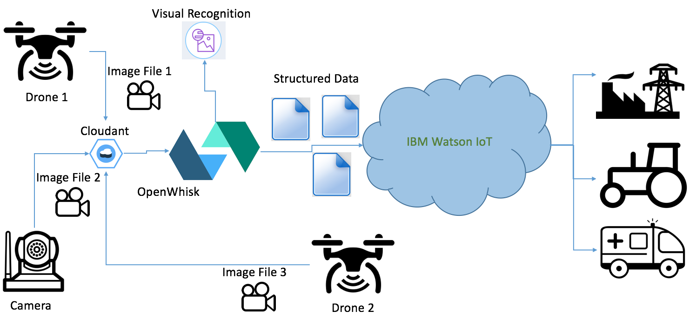

# udpro-visual-recognition-alpha

<figure><figurecaption>Unstructured Data Processor in a nutshell</figurecaption></figure>   

## Using OpenWhisk to process unstructured data for the Watson IoT Platform ##
* OpenWhisk application showing how you can use OpenWhisk to process unstructured data (image) for Watson IoT Platform
* Application takes images from Cameras (via a Cloudant NoSQL database)
* Application performs visual recognition and generates metadata for these images
* Analyzed image metadata is sent to Watson IoT Platform
* WIoTP now has capability to understand the above analyzed data along with information of the device which has sent it

**In case you want to directly jump to installation, go to the [Installation and Uninstallation steps](/documentation/deployment.md)**

## Documentation Links ##
* [Main Page](/README.md)  
* [Installation and Uninstallation steps](/documentation/deployment.md)  
* [Unstructured Data and Watson IoT Platform](/documentation/needforudpro.md)  
* [Unstructured Data Processor Workflow](/documentation/udproflow.md)  
* [Running the Application](/testclient/README.md)  
