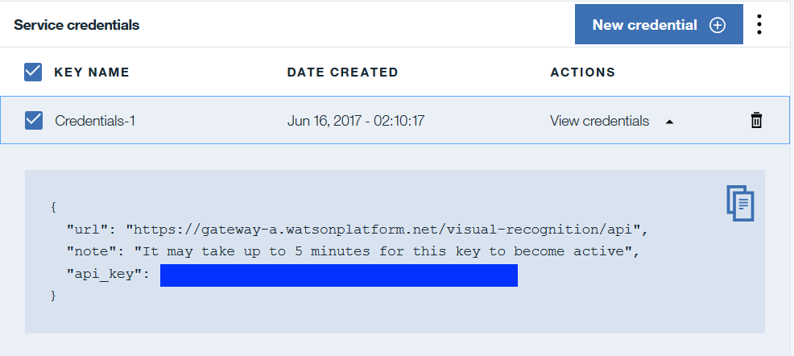
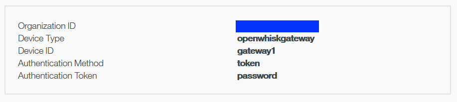

# Installation and Uninstallation steps #  

## Pre-requisites ##  
Bluemix account with    
* Bluemix Space created in US South region ([Link for creating Organization and Spaces](https://console.ng.bluemix.net/docs/admin/orgs_spaces.html#orgsspacesusers) )  
* The following services are created and you have the necessary credentials
  * [Cloudant service](https://console.ng.bluemix.net/docs/services/Cloudant/getting-started.html)  
  * [Watson Visual Recognition service](https://www.ibm.com/watson/developercloud/visual-recognition.html)  
  * [Watson Internet of Things Platform service](https://console.ng.bluemix.net/docs/services/IoT/index.html)  
You also need to download and install the [OpenWhisk CLI]. Follow the instructions at this link  https://console.ng.bluemix.net/openwhisk/learn/cli.

## Setting up Cloudant and Watson IoTP
Before you start, you need to create a Cloudant Database to receive the images from the camera. You can do this by launching the Cloudant Dashboard from Bluemix.
You also need to launch the Watson IoT Platform dashboard and register a gateway with Watson IoTP, as the OpenWhisk application connects to it as a gateway. Keep a note of the gateway credentials as you will need them in the next step.

## On Mac/Linux
Make sure that the OpenWhisk CLI executable (wsk) is in a directory on the PATH.
To verify that run  <code>wsk</code> at a command prompt.
### Steps to deploy actions, triggers and rules in OpenWhisk ##  
* Git clone the repository <pre><code>git clone https://github.com/ibm-watson-iot/openwhisk-samples.git </code></pre>
* Change to the processing directory <pre><code>cd processing  </code></pre>
* Modify the contents of the **credentials.cfg** file which contains the various environmental variables (in the form of a name-value pair) needed by Bluemix and OpenWhisk. There are five sections in this config file  

  1. Bluemix variables <pre><code># Bluemix variables
  BLUEMIX_ORG="YOUR ORG"
  BLUEMIX_SPACE="YOUR SPACE"</code></pre>
  2. Cloudant variables <pre><code># Cloudant service variables
  CLOUDANT_username="CLOUDANT_USERNAME"
  CLOUDANT_password="COUDANT_PASSWORD"
  CLOUDANT_host="CLOUDANTHOST.cloudant.com"
  CLOUDANT_db="DB_FOR_THIS_APPLICATION"</code></pre> You can obtain the first three of these values by looking at the credentials of Cloudant service in Bluemix. CLOUDANT_db is the name of the Cloudant Database that you had created to hold the captured images.
  3. You would need the API key obtained while creating Watson Visual Recognition service as shown in the below screenshot. <figure><figurecaption>Sample API Key of Watson Visual Recognition service</figurecaption></figure> <pre><code># Watson Visual Recognition service variables
  WATSON_key="VR_API_KEY"</code></pre> You need to replace the VR_API_KEY with the key that you obtained while registering the service and shown against the field "api_key" above.
  4. In Internet of Things Platform service, create a gateway type, register a gateway._(Refer to the recipe [How to Register Gateways in IBM Watson IoT Platform](https://developer.ibm.com/recipes/tutorials/how-to-register-gateways-in-ibm-watson-iot-platform/) in case you are not sure of how to create a gateway)._ <figure><figurecaption>Sample Gateway Type of WIoT service</figurecaption></figure> In the screenshot shown above, replace "MY_ORGID" with the organization (shown as 'Organization Id' in the screenshot), "MY_GATEWAY" by the Device Type (shown as 'openwhiskgateway' in the screenshot), "GATEWAY TOKEN" by the password you entered (shown as 'password' in the screenshot) <pre><code> # Watson IoT Gateway variables
  ORGID="MY_ORGID"
  GATEWAYTYPEID="MY_GATEWAY"
  GATEWAYTOKEN="GATEWAY_TOKEN"
  GATEWAYID="1212"
  EVENTTYPE="test"</code></pre>ORGID is the Watson IoT Platform organization id. Set GATEWAYTYPEID, GATEWAYID and GATEWAYTOKEN to the credentials established when the gateway was registered. EVENTTYPE specifies the Watson IoTP event type that the the OpenWhisk application will use when it posts events to Watson IoTP.
  5. OpenWhisk parameters<pre><code># OpenWhisk variables
  API_HOST="openwhisk.ng.bluemix.net"
  OW_AUTH_KEY="MY_OW_AUTH_KEY"
  CURRENT_NAMESPACE="udpro"
  PACKAGE_NAME="udpro"</code></pre>These are the OpenWhisk credentials

* Run the installation script<pre><code>./install.sh --install</code></pre> to create all the artifacts.

### Steps to undeploy actions, triggers and rules in OpenWhisk ##  
* Change to the processing directory <pre><code>cd processing  </code></pre>
* Run the uninstallation script<pre><code>./install.sh --uninstall</code></pre> to remove all the OpenWhisk artifacts.

## On Windows
 Make sure that you have added the OpenWhisk CLI(wsk.exe) to your system environmental variable.
 To verify that run  <code>wsk</code> on command prompt.

 ### Steps to deploy actions, triggers and rules in OpenWhisk ##  
* Git clone the repository <pre><code>git clone https://github.com/ibm-watson-iot/openwhisk-samples.git </code></pre>
* Change to the processing directory <pre><code>cd processing  </code></pre>
* Modify the contents of the **credentials.cfg** file which contains the various environmental variables (in the form of a name-value pair) needed by Bluemix and OpenWhisk. There are five sections in this config file  

  1. Bluemix variables <pre><code># Bluemix variables
  BLUEMIX_ORG="YOUR ORG"
  BLUEMIX_SPACE="YOUR SPACE"</code></pre>
  2. Cloudant variables <pre><code># Cloudant service variables
  CLOUDANT_username="CLOUDANT_USERNAME"
  CLOUDANT_password="COUDANT_PASSWORD"
  CLOUDANT_host="CLOUDANTHOST.cloudant.com"
  CLOUDANT_db="DB_FOR_THIS_APPLICATION"</code></pre> You can obtain the first three of these values by looking at the credentials of Cloudant service in Bluemix. CLOUDANT_db is the name of the Cloudant Database that you are going to use to hold the captured images.
  3. You would need the API key obtained while creating Watson Visual Recognition service as shown in the below screenshot. <figure><figurecaption>Sample API Key of Watson Visual Recognition service</figurecaption></figure> <pre><code># Watson Visual Recognition service variables
  WATSON_key="VR_API_KEY"</code></pre> You need to replace the VR_API_KEY with the key that you obtained while registering the service and shown against the field "api_key" above.
  4. In Internet of Things Platform service, create a gateway type, register a gateway. _(Refer to the recipe [How to Register Gateways in IBM Watson IoT Platform](https://developer.ibm.com/recipes/tutorials/how-to-register-gateways-in-ibm-watson-iot-platform/) in case you are not sure of how to create a gateway)._<figure><figurecaption>Sample Gateway Type of WIoT service</figurecaption></figure>In the screenshot shown above, replace "MY_ORGID" with the organization (shown as 'Organization Id' in the screenshot), "MY_GATEWAY" by the Device Type (shown as 'openwhiskgateway' in the screenshot), "GATEWAY TOKEN" by the password you entered (shown as 'password' in the screenshot) <pre><code> # Watson IoT Gateway variables
  ORGID="MY_ORGID"
  GATEWAYTYPEID="MY_GATEWAY"
  GATEWAYTOKEN="GATEWAY_TOKEN"
  GATEWAYID="1212"
  EVENTTYPE="test"</code></pre>ORGID is the Watson IoT Platform organization id. Set GATEWAYTYPEID, GATEWAYID and GATEWAYTOKEN to the credentials established when the gateway was registered. EVENTTYPE specifies the Watson IoTP event type that the the OpenWhisk application will use when it posts events to Watson IoTP.
  5. OpenWhisk parameters<pre><code># OpenWhisk variables
  API_HOST="openwhisk.ng.bluemix.net"
  OW_AUTH_KEY="MY_OPEN_WHISK_AUTH_KEY"
  CURRENT_NAMESPACE="udpro"
  PACKAGE_NAME="udpro"</code></pre>These are the OpenWhisk credentials

* Run the installation script<pre><code>install.bat --install</code></pre> to create all the artifacts.

### Steps to undeploy actions, triggers and rules in OpenWhisk ##  
* Change to the processing directory <pre><code>cd processing  </code></pre>
* Run the uninstallation script<pre><code>install.bat --uninstall</code></pre> to remove all the OpenWhisk artifacts.

### [Next Running the Application](/testclient/README.md)

## Documentation Links ##
* [Main Page](/README.md)  
* [Installation and Uninstallation steps](/documentation/deployment.md)  
* [Unstructured Data and Watson IoT Platform](/documentation/needforudpro.md)  
* [Unstructured Data Processor Workflow](/documentation/udproflow.md)  
* [Running the Application](/testclient/README.md)  
