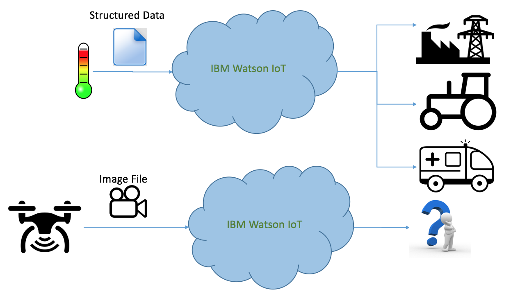

# Unstructured Data and Watson IoT Platform #   

<figure><figurecaption>Handling unstructured data with WIoTP</figurecaption></figure>  

## Watson IoT Platform understands structured data ##  
* Input data to Watson IoT Platform is in the form of structured data, typically JSON data
* WIoTP can make use of RTI (apart from other services) for taking further action on the data – which could be sending an email notification, or making a ReST call  

## Unstructured data ##   
* The Watson IoT Platform service does not provide built-in functionality to process or manipulate unstructured data such as an image or video,
* In addition, image or video files typically contain more than 128kB of data, which is beyond the maximum permissible size for messages in WIoTP
* This solution illustrates a pattern in which the image data is processed first using OpenWhisk and structured metadata describing the image is then passed to WIoTP in the form of an event.

## Documentation Links ##
* [Main Page](/README.md)  
* [Installation and Uninstallation steps](/documentation/deployment.md)  
* [Unstructured Data and Watson IoT Platform](/documentation/needforudpro.md)  
* [Unstructured Data Processor Workflow](/documentation/udproflow.md)  
* [Running the Application](/testclient/README.md)  
